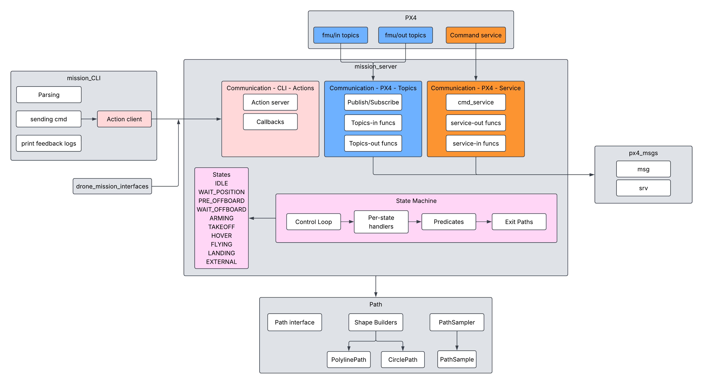

# drone_mission
* `mission_server` is the node that flies the drone. It talks to PX4 over the uXRCE-DDS bridge, arms
  it, puts it in OFFBOARD, takes off, flies the shape you asked for and lands. It listens on one
  action, `mission_command` (`drone_mission_interfaces/action/MissionCommand`).
* `mission_cli` is a simple REPL. It takes commands such as `circle 5`, `square 4`, `triangle 10` or `land` 
  and sends them to the server as goals. Feedback gets printed as simple lines. 
* `path` is the shape math, with no ROS or PX4 in it. It creates a shape and PathSampler walks that shape,
  telling mission_server where the drone should be flying.
* `drone_mission_interfaces` just holds the `MissionCommand` action, so the CLI and the server agree
  on what a goal, a result and a feedback message look like.
* `px4_msgs` is the handful of PX4 message types the server needs, copied from PX4's github. 

Patterns start and end at the current position, at the flight altitude, and are oriented by the
current heading: the circle and the square set off along it and turn right, the triangle sets off on
the diagonal to its apex, 60 deg to the right of it. `circle R` = radius R, `square L` /
`triangle L` = side length.



## Setup on a new machine

One-time steps to take a bare Ubuntu install to the point where "Running the Project" below works. Two
things come from the internet: the **code** (this repo, cloned from GitHub) and the **image**
(`ghcr.io/maringallien/px4dev:snapshot`, the pre-built container environment on GitHub Container
Registry).

### 1. Host prep
```bash
sudo apt update
sudo apt install -y docker.io x11-xserver-utils git
sudo usermod -aG docker $USER

# Then fully logout and log back in
```
The group change needs a full logout and login of the desktop session - a new terminal is not enough.
Check with `groups`, which should now list `docker`.

Have ~30 GB free before starting - the image unpacks to ~25 GB in `/var/lib/docker`.

### 2. Pull the image
```bash
docker pull ghcr.io/maringallien/px4dev:snapshot

# If you get the error: "permission denied while trying to connect to the docker API at unix:///var/run/docker.sock"
# group change was not applied, so reboot system
```
The image is the whole environment, already built: ROS 2 Jazzy, Gazebo Harmonic, PX4 prebuilt in
`/root/PX4-Autopilot/build/px4_sitl_default`, the Gazebo model cache in `/root/.gz` so SITL starts without
downloading anything, `MicroXRCEAgent` on the PATH, and a `.bashrc` that sources
`/opt/ros/jazzy/setup.bash` plus `/root/ros2_ws/install/setup.bash` once that exists.

### 3. Clone the code to `~/ros2_ws/src`
```bash
git clone https://github.com/maringallien/drone_mission ~/ros2_ws/src
```
The repo is the workspace `src/` directory itself - the three package folders sit directly under it.

### 4. Create the container (once)
```bash
xhost +local:                        # host shell, resets every login

docker run -it --name px4dev \
  --network=host --ipc=host \
  -e DISPLAY \
  -v /tmp/.X11-unix:/tmp/.X11-unix \
  -v "$HOME/ros2_ws:/root/ros2_ws" \
  --device /dev/dri \
  ghcr.io/maringallien/px4dev:snapshot
```
* `--network=host` is why UDP 8888 (the XRCE bridge) and 14550 (QGroundControl) need no port mapping.
* `-v "$HOME/ros2_ws:/root/ros2_ws"` is what puts the code inside the container. Without it there is
  nothing to build.
* `--device /dev/dri` gives Gazebo the machine's GPU to render with. If there is no `/dev/dri`, drop the
  flag: Gazebo falls back to software rendering and still runs, just slowly. `glxinfo -B | grep -i renderer`
  inside the container says which one it got.

This is run once, and leaves you in a shell inside the container. After that it is `docker start px4dev`
and `docker exec -it px4dev bash`, which is where "Running the Project" picks up.

### 5. Build the workspace (once, inside the container)
```bash
cd /root/ros2_ws
colcon build
source install/setup.bash
```
The overlay line in `.bashrc` only runs when a shell starts, so the shell that ran the first build has to
source `install/setup.bash` by hand. Every `docker exec` shell opened afterwards picks it up on its own.
Check with `ros2 pkg list | grep drone_mission`: it should list `drone_mission` and
`drone_mission_interfaces`.

`build/`, `install/` and `log/` show up on the host in `~/ros2_ws` owned by `root`, because the container
runs as root through the bind mount. Deleting them from the host side needs `sudo`.

### 6. Optional - install QGroundControl on the host
Download the appimage here: https://docs.qgroundcontrol.com/Stable_V5.1/en/qgc-user-guide/getting_started/download_and_install.html 

```bash
sudo apt install -y libfuse2t64 libxcb-xinerama0 libxkbcommon-x11-0 libxcb-cursor0
chmod +x QGroundControl-x86_64.AppImage
```
`libfuse2t64` is what the fuse2 library is called on Ubuntu 24.04 and newer; on 22.04 and older ask for
`libfuse2` instead.

It runs on the host, not in the container. Host networking means it finds the simulated vehicle on its own.

## Running the Project

### Start Docker
(Skip if container already running from setup steps above)
```bash
xhost +local:          # host shell, resets every login
docker start px4dev
```

### Terminal 1 - PX4-ROS 2 bridge
```bash
docker exec -it px4dev bash
MicroXRCEAgent udp4 -p 8888
```

### Terminal 2 - PX4 Gazebo 
```bash
docker exec -it px4dev bash
make px4_sitl gz_x500
```

### Terminal 3 - run the mission server
```bash
docker exec -it px4dev bash
ros2 launch drone_mission mission.launch.py
```
After editing any code, rebuild first: `cd /root/ros2_ws && colcon build`.

### Terminal 4 - the CLI
```bash
docker exec -it px4dev bash
ros2 run drone_mission mission_cli
```

### Optional - QGroundControl
Run the appimage from step 6 above:

```bash
./QGroundControl-x86_64.AppImage
```

This step is only to see the path being traced by the drone. 

### Teardown
1. Run Ctrl+C in all terminals. 
2. If terminal is a Docker bash shell, run `exit`
3. Once all bash shells are closed, run `docker stop px4dev`
